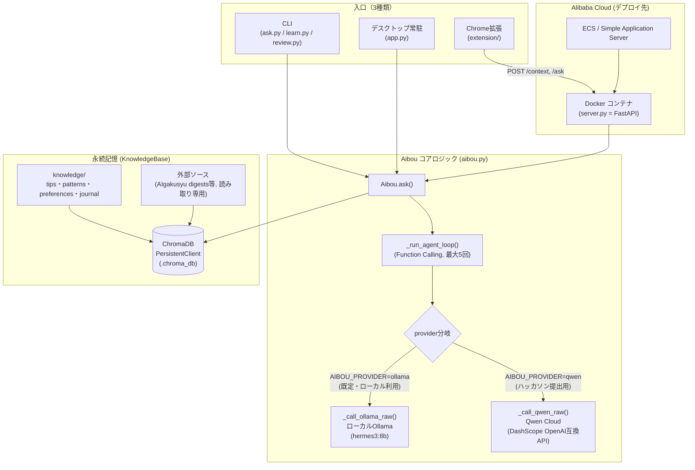

# アーキテクチャ

AIBOUは「ユーザーの学び・経験・好みを蓄積し、セッションをまたいでどんどん賢くなる」永続記憶エージェント（Track 1: MemoryAgent）です。

## ポイント

- **記憶の永続化**: `KnowledgeBase`(`aibou.py`)がMarkdown知識(`knowledge/`)をChromaDBでベクトル化・永続化。質問のたびに`search()`で関連する過去の知識を検索し、文脈として組み込む（`recalling critical memories within limited context windows`の要件に対応）。
- **セッションをまたいだ賢さ**: `learn.py`で明示的に記録した知見、`auto_learner.py`によるRSS自動収集、AIgakusyu外部ソースの取り込みにより、使うほど知識ベースが育つ。
- **プロバイダ切り替え設計**: 本番運用中の個人ツールを壊さずに新技術（Qwen Cloud）を差し込むため、`_call_ollama_raw()`内部で`self.provider`によって処理を分岐。呼び出し元（CLI/デスクトップ/サーバー）は一切変更不要。
- **デプロイ**: `server.py`(FastAPI)をDocker化し、Alibaba Cloud ECS上で稼働。`AIBOU_PROVIDER=qwen`環境変数でQwen Cloudモードに切り替える。
